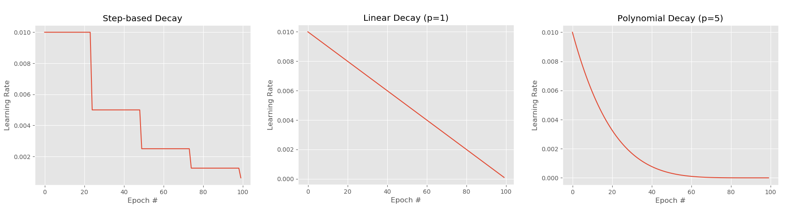

# 100DaysOfTechLearning

#### --------------------------------------------------
## Day 1(2019Aug29): Imbalance data

**Classification:** 3 main approaches
- data-based methods(sampling methods): attempt to rebalance the class distributions by resampling
    + oversampling: duplicate a number of instances of minority classes. -> weakness: may overfitting.
    + undersampling: remove a number of instances of majority classes. -> weakness: may lost important data.
    + hybrid sampling: oversample and undersample simultaneously.
    + synthetic sampling(SMOTE): an oversampling method that synthetically manufacture instances of minority classes. -> over generalization and variance?
- algorithm-based methods: put more emphasis on minority classes.
    + cost-sensitive learning: assign varying cost to different classes. -> weakness: difficult to optimize?
    + threshold-adjustment technique: ? -> weakness: difficult to optimize?
- hybrid methods: combine data-based method with algorithm-based method.
    
**Questions:**
 - What is **threshold-adjustment technique**?

#### --------------------------------------------------
## Day 2(2019Aug30): Learning rate schedule and decay

**Lesson:** https://www.pyimagesearch.com/2019/07/22/keras-learning-rate-schedules-and-decay/

**Keras training:**
There are 3 kinds of learning rate schedules:
 - step-based learning rate schedule(a).
 - linear learning rate schedule(b).
 - polynomial learning rate schedule(c).
 
Keras has 2 training modes:
 - training without learning rate decay/schedule(0).
 - training with standard optimizer learning rate decay(1).

Performance of training results: 
 - (0) < (1) < (a), (b), (c)
 - (a) may be lower than (b)

#### --------------------------------------------------
## Day 3(2019Aug31): WPF-C# Serial Communication(UART)

**Lesson:** [C# Serial Communication Sample](https://www.youtube.com/watch?v=I6uhMIFTF24)

**Key steps:**
 - Download and Install [Virtual Serial Port Driver - Create pairs of virtual COM ports linked by virtual null-modem cable](https://www.eltima.com/products/vspdxp/?gclid=CjwKCAjwkqPrBRA3EiwAKdtwk0fZBC-O-9aFVRRYszzTTXrPwYYvtPgt4zySYdK-Ep5vSizzVYoL7RoCmS0QAvD_BwE).
 Then create a pair of COM ports.
 - Download and Install [Terminal Emulator - Tera Term](https://osdn.net/projects/ttssh2/releases/). Then open Tera Term and connect to a port.
 - Create a C# serial application and connect to the other port, then send data. If Tera Term receives and displays => SUCCESS.
 
#### --------------------------------------------------
## Day 4(2019Sep01): 

#### --------------------------------------------------
## Day 5(2019Sep02): 

#### --------------------------------------------------
## Day 6(2019Sep03): 

#### --------------------------------------------------
## Day 7(2019Sep04): 

## ----------------------------------------------------
##                      1 STREAK
## ----------------------------------------------------

#### --------------------------------------------------
## Day 8(2019Sep05): 

#### --------------------------------------------------
## Day 9(2019Sep06): 

#### --------------------------------------------------
## Day 10(2019Sep07): 

#### --------------------------------------------------
## Day 11(2019Sep08): 

#### --------------------------------------------------
## Day 12(2019Sep09): 

#### --------------------------------------------------
## Day 13(2019Sep10): 

#### --------------------------------------------------
## Day 14(2019Sep11): 

## ----------------------------------------------------
##                      2 STREAKs
## ----------------------------------------------------

#### --------------------------------------------------
## Day 15(2019Sep12): 

#### --------------------------------------------------
## Day 16(2019Sep13): 

#### --------------------------------------------------
## Day 17(2019Sep14): 

#### --------------------------------------------------
## Day 18(2019Sep15): 

#### --------------------------------------------------
## Day 19(2019Sep16): 

#### --------------------------------------------------
## Day 20(2019Sep17): 

#### --------------------------------------------------
## Day 21(2019Sep18): 

## ----------------------------------------------------
##                      3 STREAKs
## ----------------------------------------------------
