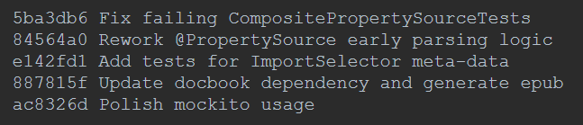

# 100DaysOfTechLearning

#### --------------------------------------------------
## Day 1(2019Aug29): Imbalance data

**Classification:** 3 main approaches
- data-based methods(sampling methods): attempt to rebalance the class distributions by resampling
    + oversampling: duplicate a number of instances of minority classes. -> weakness: may overfitting.
    + undersampling: remove a number of instances of majority classes. -> weakness: may lost important data.
    + hybrid sampling: oversample and undersample simultaneously.
    + synthetic sampling(SMOTE): an oversampling method that synthetically manufacture instances of minority classes. -> over generalization and variance?
- algorithm-based methods: put more emphasis on minority classes.
    + cost-sensitive learning: assign varying cost to different classes. -> weakness: difficult to optimize?
    + threshold-adjustment technique: ? -> weakness: difficult to optimize?
- hybrid methods: combine data-based method with algorithm-based method.
    
**Questions:**
 - What is **threshold-adjustment technique**?

#### --------------------------------------------------
## Day 2(2019Aug30): Learning rate schedule and decay


**Lesson:** https://www.pyimagesearch.com/2019/07/22/keras-learning-rate-schedules-and-decay/

**Keras training:**
There are 3 kinds of learning rate schedules:
 - step-based learning rate schedule(a).
 - linear learning rate schedule(b).
 - polynomial learning rate schedule(c).
 
Keras has 2 training modes:
 - training without learning rate decay/schedule(0).
 - training with standard optimizer learning rate decay(1).

Performance of training results: 
 - (0) < (1) < (a), (b), (c)
 - (a) may be lower than (b)

#### --------------------------------------------------
## Day 3(2019Aug31): C# Serial Communication(UART) + WPF UI Creation

**Lesson:** [C# Serial Communication Sample](https://www.youtube.com/watch?v=I6uhMIFTF24)

**Key steps:**
 - Download and Install [Virtual Serial Port Driver - Create pairs of virtual COM ports linked by virtual null-modem cable](https://www.eltima.com/products/vspdxp/?gclid=CjwKCAjwkqPrBRA3EiwAKdtwk0fZBC-O-9aFVRRYszzTTXrPwYYvtPgt4zySYdK-Ep5vSizzVYoL7RoCmS0QAvD_BwE).
 Then create a pair of COM ports.
 - Download and Install [RS232 Terminal Emulator - Termite](https://www.compuphase.com/software_termite.htm). Then open Tera Term and connect to a port.
 - Create a C# serial application and connect to the other port, then send data. If Tera Term receives and displays => SUCCESS.
 
**Lecture Video:** [Create WPF UI Tutorials: 01 - The Basics](https://www.youtube.com/watch?v=Vjldip84CXQ&list=PLrW43fNmjaQVYF4zgsD0oL9Iv6u23PI6M)

> It'd better to build WPF UI on Blend.
 
#### --------------------------------------------------
## Day 4(2019Sep01): WPF-C# Serial Communication + Git Commit Conventions

### WPF-C#:

**Practices** [Build WPF-C# Serial Sending](https://github.com/minhncedutw/wpf-serial-communication.git).

**Notice:**
 - WPF doesn't have SerialPort component like C#.
 - To use SerialPort, we have to self-declare a global variable of SerialPort: 
 ```WPF-C#
 using System.IO.Ports;
 ...
    SerialPort serialPort = new SerialPort();
 ```
 - WPF can not add port to ComboBox by `AddRange(ports)` like C#, hence we have to manually and sequentially add ports:
 ```
    string[] ports = SerialPort.GetPortNames();
            
    foreach (string port in ports) cBoxComPort.Items.Add(port);
 ```
 - SerialPort does not have **default EventHandler** of receiving data. We have to self-define and add receiving handler to SerialPort properties manually:
 ```WPF-C#
    serialPort.DataReceived += new System.IO.Ports.SerialDataReceivedEventHandler(serialPort_DataRecieved);
 ...
    private delegate void UpdateUiTextDelegate(string text);
    private void serialPort_DataRecieved(object sender, System.IO.Ports.SerialDataReceivedEventArgs e)
    {
        // Collecting the characters received to our 'buffer' (string).
        recievedData = serialPort.ReadExisting();

        // Delegate a function to display the received data.
        Dispatcher.Invoke(DispatcherPriority.Send, new UpdateUiTextDelegate(DataWrited), recievedData);
    }

    private void DataWrited(string text)
    {
        tBoxInData.Text += text;
    }
 ``` 
 - In EventHandler, we can not display data to component like this: `tBoxInData.Text += recievedData;`
 We have to delegate a function to operate or display the received data out: `Dispatcher.Invoke(DispatcherPriority.Send, new UpdateUiTextDelegate(DataWrited), recievedData);`. 
 - WPF can print messages at Output tab: `Console.WriteLine("Message!!!");`.
 
**Lecture:** [WPF Serial Communication](https://www.codeproject.com/Articles/130109/Serial-Communication-using-WPF-RS232-and-PIC-Commu)

**Reference Code:** [WPF Serial Communication](https://github.com/JohnnyPP/WPF-Serial-Communication-Advanced/blob/master/Serial%20Communication%20WPF/MainWindow.xaml.cs)

### Git:
**Git Commit Conventions:**
 - [Lecture: How to Write a Git Commit Message](https://chris.beams.io/posts/git-commit/)
 - Start with subject action(verb): Add, Fix, Modify, Change, Remove, Release, ...


#### --------------------------------------------------
## Day 5(2019Sep02): 


#### --------------------------------------------------
## Day 6(2019Sep03): 


#### --------------------------------------------------
## Day 7(2019Sep04): 

## ----------------------------------------------------
##                      1 STREAK
## ----------------------------------------------------

#### --------------------------------------------------
## Day 8(2019Sep05): 


#### --------------------------------------------------
## Day 9(2019Sep06): 


#### --------------------------------------------------
## Day 10(2019Sep07): 


#### --------------------------------------------------
## Day 11(2019Sep08): 


#### --------------------------------------------------
## Day 12(2019Sep09): 


#### --------------------------------------------------
## Day 13(2019Sep10): 


#### --------------------------------------------------
## Day 14(2019Sep11): 

## ----------------------------------------------------
##                      2 STREAKs
## ----------------------------------------------------

#### --------------------------------------------------
## Day 15(2019Sep12): 


#### --------------------------------------------------
## Day 16(2019Sep13): 


#### --------------------------------------------------
## Day 17(2019Sep14): 


#### --------------------------------------------------
## Day 18(2019Sep15): 


#### --------------------------------------------------
## Day 19(2019Sep16): 


#### --------------------------------------------------
## Day 20(2019Sep17): 


#### --------------------------------------------------
## Day 21(2019Sep18): 

## ----------------------------------------------------
##                      3 STREAKs
## ----------------------------------------------------
