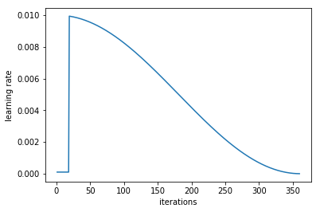
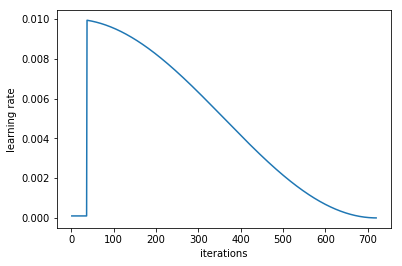

# 100DaysOfMLCode

## Day 1(03March2019): Study how pytorch do classification? log_softmax?
 - Q: How to do fastai PointNet?
 - Q: Why pointnet_pytorch they do not directly use cross-entropy? Is it related to special shape of data? 
 Or is it still able to use cross-entropy?
 - A: We can directly define cross-entropy, need not use `log_softmax` and `nll_loss`. Just call 
 `loss = F.cross_entropy(outputs, target)`
 - Q: cross-entropy = log_softmax + nll_loss?
 - A: YES. CrossEntropyLoss() is combination combines LogSoftmax() and NLLLoss() 
 [source](https://pytorch.org/docs/stable/nn.html#torch.nn.CrossEntropyLoss) 
 - Q: How to do softmax? cross-entropy? input/output shape of each one?
 - A: cross-entropy and log_softmax has the same input shape: (N, C, d1, d2, .. , dK)
 - Q: Can it do softmax without *.view(...)?
 - A: need not use *.view, just directly deploy cross_entroypy or nll_loss...

## Day 2(04March2019): Code PointNet using cross-entropy instead of log_softmax on pytorch framework
[Source code](https://github.com/minhncedutw/pointnet1_pytorch.git)

## Day 3(05March2019): Code PointNet training on fastai framework
[Source code](https://github.com/minhncedutw/pointnet1_fastai.git)

## Day 4(06March2019): How to test/evaluate network on fastai framework
- *Prediction* on <ins>validation data</ins>:
```python
pred_logits, true_label = learner.TTA(is_test=False) # this func return logit predictions and labels
pred_probs = np.mean(np.exp(pred_logits),0) # this func convert logits to probabilities
```

or:
```python
pred_logits = learner.predict(is_test=False) # is_test=False -> test on validation dataset; is_test=True -> test on test dataset
pred_labels = np.argmax(pred_logits, axis=1)
pred_probs = np.exp(pred_logits[:,1])
```

- *Prediction* on <ins>test data</ins>:
`
log_preds, y = learner.TTA(is_test=True)
probs = np.mean(np.exp(log_preds),0)
`

- How to *evaluate*:
`
accuracy_np(probs, y)
`

- How to train:
    + Gross training: 
    `lrf=learn.lr_find()
     learn.sched.plot()
     learn.sched.plot_lr()
     learn.fit(1e-2, 1)`
    + Finetune training: 
    `lrs=np.array([1e-4,1e-3,1e-2])
     lrf=learn.lr_find()
     learn.sched.plot()
     learn.sched.plot_lr()
     learn.fit(lrs, 3, cycle_len=1, cycle_mult=2)`
   
## Day 5(07March2019): How to get train/val/tes data on fastai framework

- Get data from model_data:
```python
x,y = next(iter(model_data.trn_dl))
x,y = next(iter(model_data.val_dl))
x,y = next(iter(model_data.tes_dl))
```

- But *before* taking data from model_data, we have to define model_data:
```python
model_data = ImageClassifierData.from_csv(path=PATH, tfms=tfms_from_model(f_model=arch, sz=sz, aug_tfms=None))
#                                                    transformation       architecture  size   augmentation
```
```python
model_data = ImageClassifierData.from_paths(path=PATH, tfms=tfms_from_model(f_model=arch, sz=sz))
```
```python
# example of custom data model:
trn_ds = load_data_function(...)
val_ds = load_data_function(...)

trn_dl = DataLoader(dataset=trn_ds, batch_size=batch_size, shuffle=True, num_workers=0, pin_memory=True)
val_dl = DataLoader(dataset=val_ds, batch_size=batch_size, shuffle=False, num_workers=0, pin_memory=True)
tes_dl = None

model_data = ModelData(path=directory, trn_dl=trn_dl, val_dl=val_dl, test_dl=None)
```

- Before defining model_data, we may need to define transformation:
```python
tfms = tfms_from_model(f_model=f_model, sz=sz, aug_tfms=transforms_side_on, crop_type=CropType.NO)
```

## Day 6(08March2019): Code dogs-cats classification on fastai framework

## Day 7(09March2019): How learner.fit works?(fastai framework)

learner.fit(lrs=lr, n_cycle=1, cycle_len=1)





## Questions: 
 - How to run pytorch network on cuda?
 - How to run test/eval network?
 - How to use func fit(...)?
 - How to load train/val/tes data in fastai?
 - How to normalize/denormalize data?
 - Why learner.TTA returns different to learner.predict 
 - What is acc in training? (acc of train or val?)