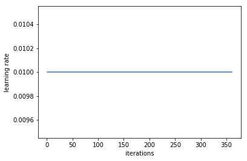
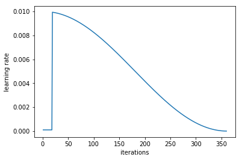
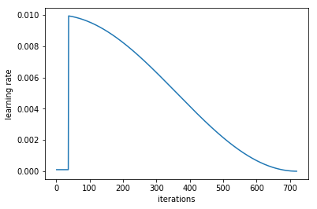
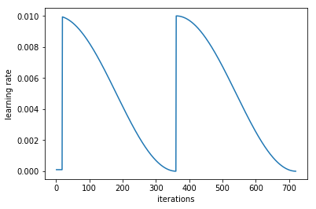
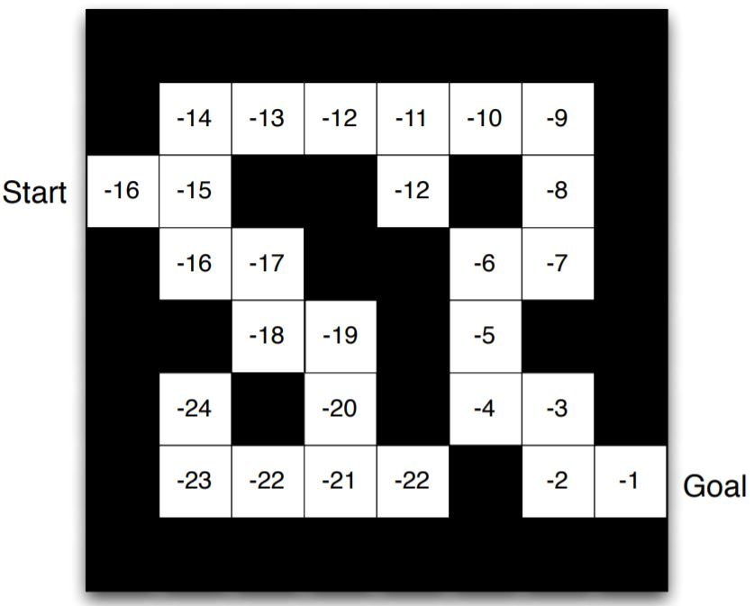
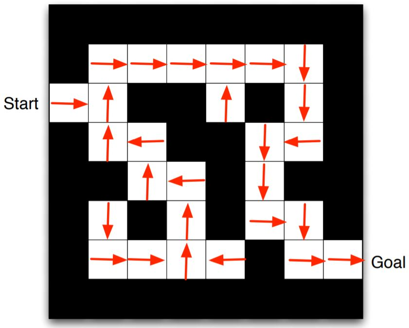
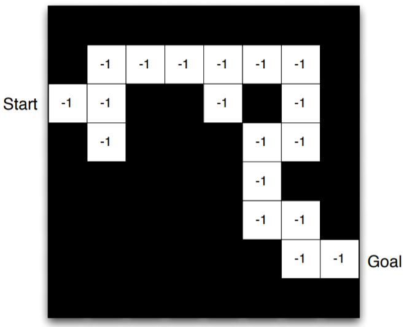
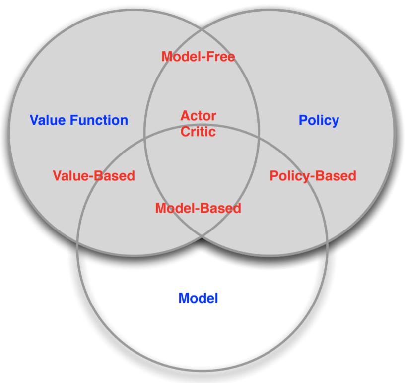
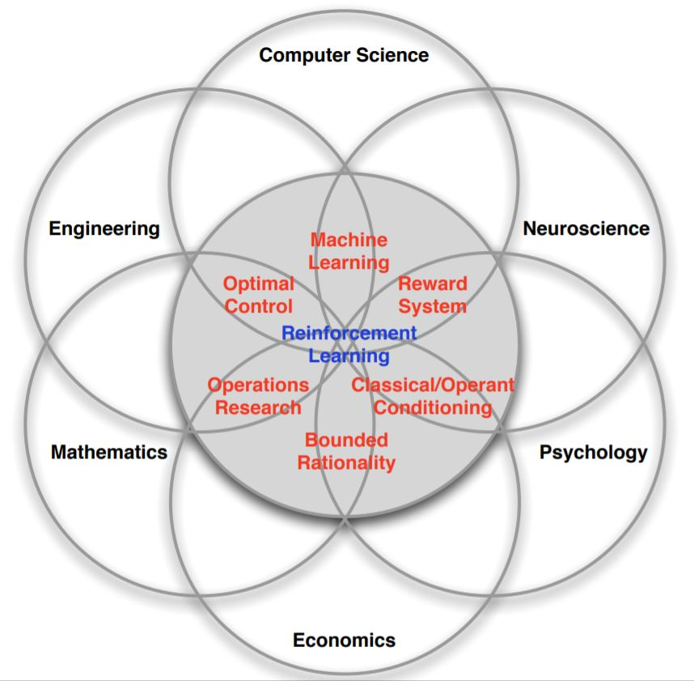
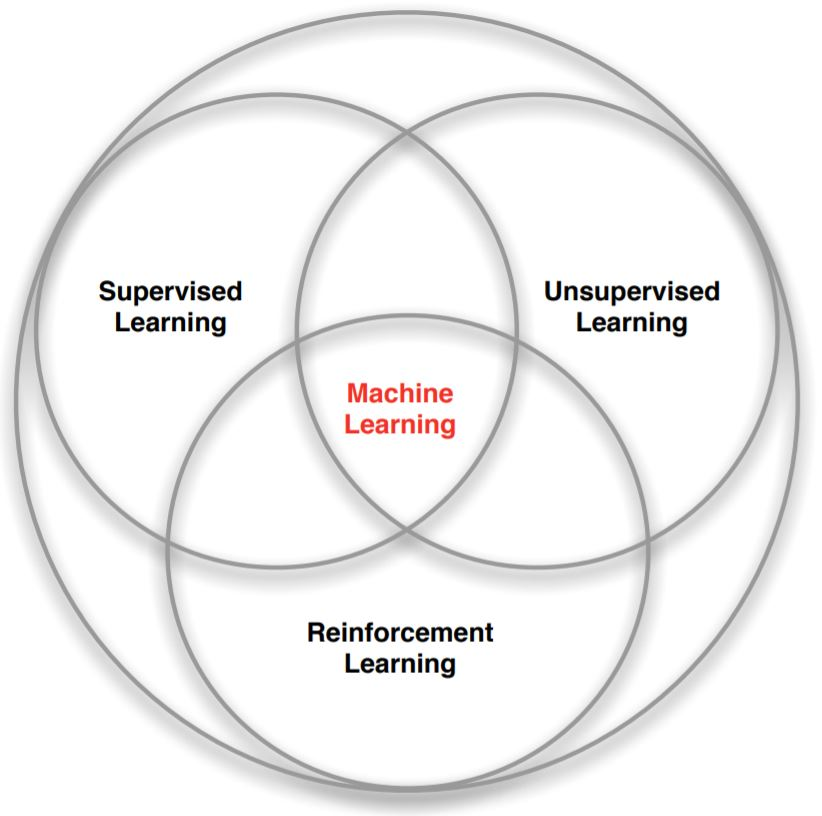

# 100DaysOfMLCode

## Day 1(03Feb2019): Study how pytorch do classification? log_softmax?
 - Q: How to do fastai PointNet?
 - Q: Why pointnet_pytorch they do not directly use cross-entropy? Is it related to special shape of data? 
 Or is it still able to use cross-entropy?
 - A: We can directly define cross-entropy, need not use `log_softmax` and `nll_loss`. Just call 
 `loss = F.cross_entropy(outputs, target)`
 - Q: cross-entropy = log_softmax + nll_loss?
 - A: YES. CrossEntropyLoss() is combination combines LogSoftmax() and NLLLoss() 
 [source](https://pytorch.org/docs/stable/nn.html#torch.nn.CrossEntropyLoss) 
 - Q: How to do softmax? cross-entropy? input/output shape of each one?
 - A: cross-entropy and log_softmax has the same input shape: (N, C, d1, d2, .. , dK)
 - Q: Can it do softmax without *.view(...)?
 - A: need not use *.view, just directly deploy cross_entroypy or nll_loss...

## Day 2(04Feb2019): Code PointNet using cross-entropy instead of log_softmax on pytorch framework
[Source code](https://github.com/minhncedutw/pointnet1_pytorch.git)

## Day 3(05Feb2019): Code PointNet training on fastai framework
[Source code](https://github.com/minhncedutw/pointnet1_fastai.git)

## Day 4(06Feb2019): How to test/evaluate network on fastai framework
- *Prediction* on <ins>validation data</ins>:
```python
pred_logits = learner.predict(is_test=False) # is_test=False -> test on validation dataset; is_test=True -> test on test dataset
pred_labels = np.argmax(pred_logits, axis=1)
pred_probs = np.exp(pred_logits[:,1])
```

or:
```python
pred_logits, true_label = learner.TTA(is_test=False) # 'test time augmentation' func return logit predictions and labels of augmented data
pred_probs = np.mean(np.exp(pred_logits),0) # this func convert logits to probabilities(by default, each data causes 4 
                                            # augmented data, so each test data has 5 returned results, so we have to 
                                            # use np.mean to get predicted probability of each test data 
```

- *Prediction* on <ins>test data</ins>:
`
log_preds, y = learner.TTA(is_test=True)
probs = np.mean(np.exp(log_preds),0)
`

- How to *evaluate*:
`
accuracy_np(probs, y)
`

- How to train:
    + Gross training: 
    `lrf=learn.lr_find()
     learn.sched.plot()
     learn.sched.plot_lr()
     learn.fit(1e-2, 1)`
    + Finetune training: 
    `lrs=np.array([1e-4,1e-3,1e-2])
     lrf=learn.lr_find()
     learn.sched.plot()
     learn.sched.plot_lr()
     learn.fit(lrs, 3, cycle_len=1, cycle_mult=2)`
   
## Day 5(07Feb2019): How to get train/val/tes data on fastai framework

- Get data from model_data:
```python
x,y = next(iter(model_data.trn_dl))
x,y = next(iter(model_data.val_dl))
x,y = next(iter(model_data.tes_dl))
```

- But *before* taking data from model_data, we have to define model_data:
```python
model_data = ImageClassifierData.from_csv(path=PATH, tfms=tfms_from_model(f_model=arch, sz=sz, aug_tfms=None))
#                                                    transformation       architecture  size   augmentation
```
```python
model_data = ImageClassifierData.from_paths(path=PATH, tfms=tfms_from_model(f_model=arch, sz=sz))
```
```python
# example of custom data model:
trn_ds = load_data_function(...)
val_ds = load_data_function(...)

trn_dl = DataLoader(dataset=trn_ds, batch_size=batch_size, shuffle=True, num_workers=0, pin_memory=True)
val_dl = DataLoader(dataset=val_ds, batch_size=batch_size, shuffle=False, num_workers=0, pin_memory=True)
tes_dl = None

model_data = ModelData(path=directory, trn_dl=trn_dl, val_dl=val_dl, test_dl=None)
```

- Before defining model_data, we may need to define transformation:
```python
tfms = tfms_from_model(f_model=f_model, sz=sz, aug_tfms=transforms_side_on, crop_type=CropType.NO)
```

## Day 6(08Feb2019): Code dogs-cats classification on fastai framework

[Practiced code](day6[dogscats_fastai]/PRAC_lesson_1.ipynb)

## Day 7(09Feb2019): How learner.fit works?(fastai framework)

- Training usual
`learner.fit(lrs=lr, n_cycle=1) # learning rate is constant(usual training technique)`


`learner.fit(lrs=lr, n_cycle=1, cycle_len=1) # learning rate is a curve, the frequency of the curve is 1(learning rate annealing)`


`learner.fit(lrs=lr, n_cycle=1, cycle_len=2) # => cycle of learning rate curve is 2 epochs, loop 1 times, epochs=2`


`learner.fit(lrs=lr, n_cycle=2, cycle_len=1) # => cycle of learning rate curve is 1 epochs, loop 2 times, epochs=2(SGD with restarts)`


`learner.fit(lrs=lr, n_cycle=2, cycle_len=2) # => cycle of learning rate curve is 2 epochs, loop 2 times, epochs=4(SGD with restarts)`


`learner.fit(lrs=lr, n_cycle=3, cycle_len=1, cycle_mult=2) # => This SGD with restarts sometimes give awesome results(total epochs=1+2+4=7)`
`# the cycle of LR is double at the end of each train cycle`


> total epochs = n_cycle * cycle_len

-  Training different learning rates for different layers(groups of layers):
```python
lrs = np.array([1e-4,1e-3,1e-2])
learner.fit(lrs=lrs, n_cycle=3, cycle_len=1)
```
> The first few layers will be at 1e-4, the middle layers at 1e-3, and our FC layers we'll leave at 1e-2. To do this, the model architecture must be defined as 3 layers.

## Day 8(10Feb2019): How to predict from arbitrary data

```python
# predict from array
pred_logs = learner.predict_array(arr=array)
pred_labels = np.argmax(pred_logs, axis=1)
pred_probs = np.exp(pred_logs[:,1])
``` 

or
```python
# predict from array
pred_logs = preds = to_np(learner.model(V(T(array).cuda())))
pred_labels = np.argmax(pred_logs, axis=1)
pred_probs = np.exp(pred_logs[:,1])
``` 

or
```python
# predict from data loader
bx, by = next(iter(val_dl))
pred_logs = learner.predict_array(arr=bx)
pred_labels = np.argmax(pred_logs, axis=1)
pred_probs = np.exp(pred_logs)
acc = accuracy_np(pred_probs, by)
metrics.log_loss(y, pred_probs)
```

## Day 9(11Feb2019): How fastai summary network architecture?

```python
learner.summary()
```

How fastai split train/val data?
    - fastai does NOT split data
    - split manually or use the supplied `get_cv_idxs` function

## Day 10(12Feb2019): How fastai normalize/denomalize?
- Normalize
```python
stats = (np.array([ 0.4914 ,  0.48216,  0.44653]), np.array([ 0.24703,  0.24349,  0.26159])) # normalizing data
tfms = tfms_from_stats(stats=stats, sz=sz, aug_tfms=[RandomFlip()], pad=sz//8)
data = ImageClassifierData.from_csv(PATH, 'train', PATH/'train.csv', tfms=tfms, bs=bs)
```

- Denormalize
```python
x, y = next(iter(model_data.test_dl))
denormed_data = model_data.test_ds.denorm(x)[0]
plt.imshow(denormed_data)
```

## Day 11(13Feb2019): How pytorch normalize/denomalize?
- Normalize
```python
transform = transforms.Compose([transforms.ToTensor(), transforms.Normalize(means=(0.5, 0.5, 0.5), std=(0.5, 0.5, 0.5))])
trainset = torchvision.datasets.CIFAR10(root='./data', train=True,
                                        download=True, transform=transform)
trainloader = torch.utils.data.DataLoader(trainset, batch_size=4,
                                          shuffle=True, num_workers=2)
```

- Denormalize
```python
inv_normalize = transforms.Normalize(mean=[-0.5/0.5, -0.5/0.5, -0.5/0.5], # -mean/std
                                     std=[1/0.5, 1/0.5, 1/0.5] # 1/std
)
inv_tensor = inv_normalize(tensor)
```

## Day 12(14Feb2019): Different Type of Convolution in Deep Learning?

>Convolution v.s. Cross-correlation
3D Convolution
1 x 1 Convolution
Transposed Convolution (Deconvolution, checkerboard artifacts)
Dilated Convolution (Atrous Convolution)
Separable Convolution (Spatially Separable Convolution, Depthwise Convolution)
Flattened Convolution
Grouped Convolution
Shuffled Grouped Convolution
Pointwise Grouped Convolution

[Source](https://towardsdatascience.com/a-comprehensive-introduction-to-different-types-of-convolutions-in-deep-learning-669281e58215?fbclid=IwAR06RxGPwRmN_6lzgKypLxcQm0r2YPtebBHxclpKXsZ1D96n56NVnGugBt8)

## Day 13(15Feb2019): Different Type of GAN?

>unconditional GAN
conditional GAN
SS-GAN

### Questions:
- what is different between 3 kinds of GANs?

## Day 14(16Feb2019): How to run pytorch network on cuda?
```python
device = torch.device("cuda:0" if torch.cuda.is_available() else "cpu")
...
net.to(device)
...
inputs, labels = inputs.to(device), labels.to(device)
```

## Day 15(17Feb2019): How fastai show learned features?

## Day 16(18Feb2019): USING T-SNE TO VISUALISE HOW YOUR MODEL THINKS?

*Keras-Embedding Visualization* [tensorboard_embeddings_mnist.py](https://github.com/keras-team/keras/blob/36b9e4c055f32718a036cabaf767325b010c7485/examples/tensorboard_embeddings_mnist.py#L64)
*Good illustration* [TENSORFLOW - EMBEDDING VISUALISATION MNIST DATASET](https://www.youtube.com/watch?v=EL0wVFz0gsc)
*Good doc* [USING T-SNE TO VISUALISE HOW YOUR MODEL THINKS](https://buzzrobot.com/using-t-sne-to-visualise-how-your-deep-model-thinks-4ba6da0c63a0)
*Good doc* [MANIFOLD LEARNING ON HANDWRITTEN DIGITS](https://scikit-learn.org/stable/auto_examples/manifold/plot_lle_digits.html#sphx-glr-auto-examples-manifold-plot-lle-digits-py)

## Day 17(19Feb2019): ?

## Day 18(20Feb2019): Overview about Deep Reinforcement Learning?

What is an RL agent? Ans: It is composed from:
- Reward value:

- Policy:

- Model state:


Categorizing:


*Good lessons* [UCL Course on RL](http://www0.cs.ucl.ac.uk/staff/d.silver/web/Teaching.html)

[A DEEP DIVE INTO REINFORCEMENT LEARNING](https://www.toptal.com/machine-learning/deep-dive-into-reinforcement-learning)





## Day 25(27Feb2019): ?

## Day 26(28Feb2019): Learn TensorFlow 2.0 on [UDACITY](https://www.udacity.com/course/intro-to-tensorflow-for-deep-learning--ud187?fbclid=IwAR1hWOw9_WBMoe7gAQOyppYtr82lDxy0gu3u8bre4VMoG8w4nVIPHEAKIAc) - Use TensorFlow like Keras
- Lesson 1&2&3:
*Practiced Code*
[](https://drive.google.com/open?id=1nrOW-tlFN_B6zQKHWDYuKtS-64glCYZP)
[](https://drive.google.com/open?id=1cKs5sR_Qhng3l4JKbmUhsqrWBG-kmszs)
[](https://drive.google.com/open?id=1vkRG9NeHkBk5vTekxRz8whzIjR0kA-k-)

*Use tensorflow like keras*
```python
model = tf.keras.Sequential([
    tf.keras.layers.Flatten(input_shape=(28, 28, 1)),
    tf.keras.layers.Dense(units=128, activation=tf.nn.relu),
    tf.keras.layers.Dense(units=10, activation=tf.nn.softmax)
])

model.compile(optimizer='adam',
              loss = 'sparse_categorical_crossentropy',
              metrics=['accuracy'])

history = model.fit(train_dataset, epochs=10, steps_per_epoch=math.ceil(num_train_examples/batch_size))
```

## Day 27(01Mar2019): Learn TensorFlow 2.0 on [COURSERA](https://www.coursera.org/learn/introduction-tensorflow) - Basic Knowledge
- Lesson 1
[Practiced Code](https://drive.google.com/open?id=1GS3zwZxCr8pFWU_Y-GXi4pVINh8ciQ5z)

*The way to get sample of a function in colab*

**source** [GET STARTED WITH GOOGLE COLABORATORY (CODING TENSORFLOW)](https://youtu.be/inN8seMm7UI)

*Compare algorithms on MNIST*

[FASHION-MNIST](https://github.com/zalandoresearch/fashion-mnist)

## Day 28(02Mar2019): Learn TensorFlow 2.0 on [COURSERA](https://www.coursera.org/learn/introduction-tensorflow) - Callbacks?
- Lesson 2&3:
[Practiced Code](https://drive.google.com/open?id=13UrqN73m8VW4U8qCY8ZnRR7pH1sQBx0-)
[Practiced Code](https://drive.google.com/open?id=1UjAZfTze-AqoJ6nfVLGHJ0bWZlJvOBcr)

*How to code Custom callback to get 'acc' value and stop at condition*
```python
class myCallBack(tf.keras.callbacks.Callback):
    def on_epoch_end(self, epochs, log={}):
        if (log.get('acc') > 0.95):
            print("\nReached 95% accuracy so cancelling training!")
            self.model.stop_training = True
```

*Lesson about CNN of Andrew Ng*
[Convolutional Neural Networks(Course 4 of the Deep Learning Specialization)](https://www.youtube.com/playlist?list=PLkDaE6sCZn6Gl29AoE31iwdVwSG-KnDzF)

## Day 29(03Mar2019): OpenAI Text Generator - Generative Pre-Training
Siraj Raval video: [OPENAI TEXT GENERATOR](https://www.youtube.com/watch?v=0n95f-eqZdw)

*Main content*:
- Introduce GPT-2 (Generative Pre-Training 2)
- Applications of GPT-2: machine translation, summarization, question answering -> chat bot
- Principles of GPT-2

*Download and Run*: [gpt-2](https://github.com/openai/gpt-2)

## Day 30(04Mar2019): Learn TensorFlow 2.0 on [Coursera](https://www.coursera.org/learn/introduction-tensorflow)

- Lesson 4:
[Practiced Code]()

*Knowledge*
- relu is used in hidden layers
- linear is used in regression
- softmax is used in categorical classification(multiple classes)
- sigmoid is better than softmax in binary classification

*Size of final features affect FC*
> size of finaly features should not be too small, else the FC classification may not be able to converge

## Day 31(05Mar2019): Learn TensorFlow 2.0 on [Coursera](https://www.coursera.org/learn/introduction-tensorflow) - How to observe learnt features?

*How to download at Colab*
```
# Download from a link to a file path
!wget --no-check-certificate \
    https://storage.googleapis.com/laurencemoroney-blog.appspot.com/horse-or-human.zip \
    -O /tmp/horse-or-human.zip
```

*How to unzip file at Colab*
```python
import os
import zipfile

local_zip = '/tmp/horse-or-human.zip'
zip_ref = zipfile.ZipFile(local_zip, 'r')
zip_ref.extractall('/tmp/horse-or-human')
zip_ref.close()
```

*How to upload to Colab through simple dialog?*
```python
import numpy as np
from google.colab import files
from keras.preprocessing import image

uploaded = files.upload() # Create a dialog to upload the file

for fn in uploaded.keys():
 
  # Obtain uploaded files
  path = '/content/' + fn
  img = image.load_img(path, target_size=(300, 300))
  x = image.img_to_array(img)
  x = np.expand_dims(x, axis=0)
  images = np.vstack([x])
  
  """
  Below is custom codes depended on your purpose
  """
  classes = model.predict(images, batch_size=10)
  print(classes[0])
  if classes[0]>0.5:
    print(fn + " is a human")
  else:
    print(fn + " is a horse")
```
*How to observe learned features?*
```python
successive_outputs = [layer.output for layer in model.layers[1:]]
visualization_model = tf.keras.models.Model(inputs=model.input, outputs=successive_outputs) # Define a model that obtain learnt features of each layer in model

successive_feature_maps = visualization_model.predict(x) # get feature map
```
[source](https://drive.google.com/open?id=1rXD7Kr3gHIydnkxo4jX2JAGotFADOTIb)

## Day 32(06Mar2019): How to create model of Multiple Inputs/Outputs in Keras?

 - Multiple Inputs(single type) - Single Output
```python
# define two sets of inputs
inputA = Input(shape=(32,))
inputB = Input(shape=(128,))
 
# the first branch operates on the first input
x = Dense(8, activation="relu")(inputA)
x = Dense(4, activation="relu")(x)
x = Model(inputs=inputA, outputs=x)
 
# the second branch opreates on the second input
y = Dense(64, activation="relu")(inputB)
y = Dense(32, activation="relu")(y)
y = Dense(4, activation="relu")(y)
y = Model(inputs=inputB, outputs=y)
 
# combine the output of the two branches
combined = concatenate([x.output, y.output])
 
# apply a FC layer and then a regression prediction on the
# combined outputs
z = Dense(2, activation="relu")(combined)
z = Dense(1, activation="linear")(z)
 
# our model will accept the inputs of the two branches and
# then output a single value
model = Model(inputs=[x.input, y.input], outputs=z)
```

 - Multiple Inputs(multiple type) - Single Output
 ```python
# create the MLP and CNN models
mlp = models.create_mlp(trainAttrX.shape[1], regress=False)
cnn = models.create_cnn(64, 64, 3, regress=False)

# create the input to our final set of layers as the *output* of both
# the MLP and CNN
combinedInput = concatenate([mlp.output, cnn.output])

# our final FC layer head will have two dense layers, the final one
# being our regression head
x = Dense(4, activation="relu")(combinedInput)
x = Dense(1, activation="linear")(x)

# our final model will accept categorical/numerical data on the MLP
# input and images on the CNN input, outputting a single value (the
# predicted price of the house)
model = Model(inputs=[mlp.input, cnn.input], outputs=x)
```
[source](https://www.pyimagesearch.com/2019/02/04/keras-multiple-inputs-and-mixed-data/)

*How to do multi-inp multi-out?*
 - [such as this](https://keras.io/getting-started/functional-api-guide/#multi-input-and-multi-output-models)

## Day 33(07Mar2019): How to use yeild in python?
```python
def foo():
    for i in range(1000000000):
        if i %100000000==0:
            yield i

print(foo) # WRONG using

# Correct way to use
for i in foo():
    print(i)
```

*Steps to explore and solve an AI problem?*

[source](https://www.kaggle.com/agodwinp/stacking-house-prices-walkthrough-to-top-5/notebook)

## Day 34(08Mar2019): How to design multi-block of layers for network to train multi-lr?
[Practiced code](day34[fastai_multi_lr]/multi_groups_of_layers_for_multi_lrs.py)

## Day 35(10Mar2019): Fastai 2019 - Lesson 1

*How to download to a directory?*
```python
path = untar_data(url=URLs.PETS, dest='./data/'); path
```

*How to obtain data from path and extract labels from names?*
```python
fnames = get_image_files(path_img)

# np.random.seed(2) # not important
pattern = r'/([^/]+)_\d+.jpg$' # define the pattern of the file name

# Data generation from path to images and auto-extract labels from names
data = ImageDataBunch.from_name_re(path=path_img, fnames=fnames, pat=pattern, 
                                   ds_tfms=get_transforms(), size=224, bs=bs
                                  ).normalize(imagenet_stats)
```


## FastAI Lessons:

https://course.fast.ai/videos/?lesson=6

https://www.youtube.com/user/howardjeremyp/playlists

## Questions: 
 - How to run pytorch network on cuda?
 - Why fastai/pytorch return logs of predictions rather than probabilities?
 - How fastai custom metrics, loss_function?
 - How fastai group the layers for training many lr?
 - What is wds?
 - How fastai show learned features?
 - How deploy an app to github?
 
## AI Magazine:
https://paperswithcode.com/sota?fbclid=IwAR0EGz0FvBiX8AROM1madjSxhpDxLJ_pNGVk5oR4p-cREuWmrGh-F1OX1jQ
https://www.rsipvision.com/computer-vision-project-management/