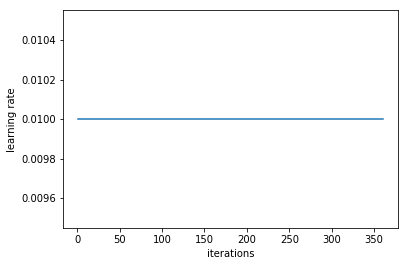
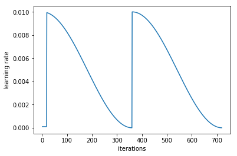
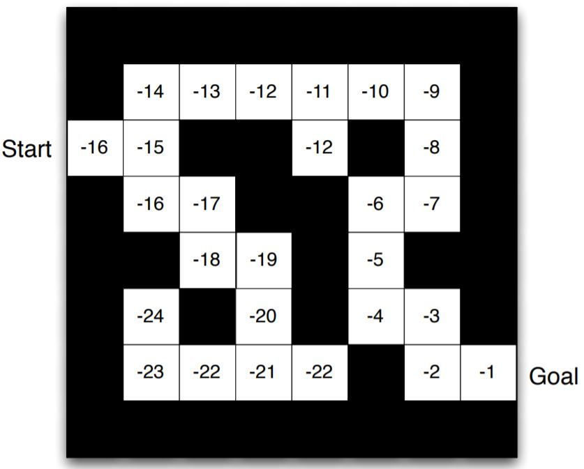
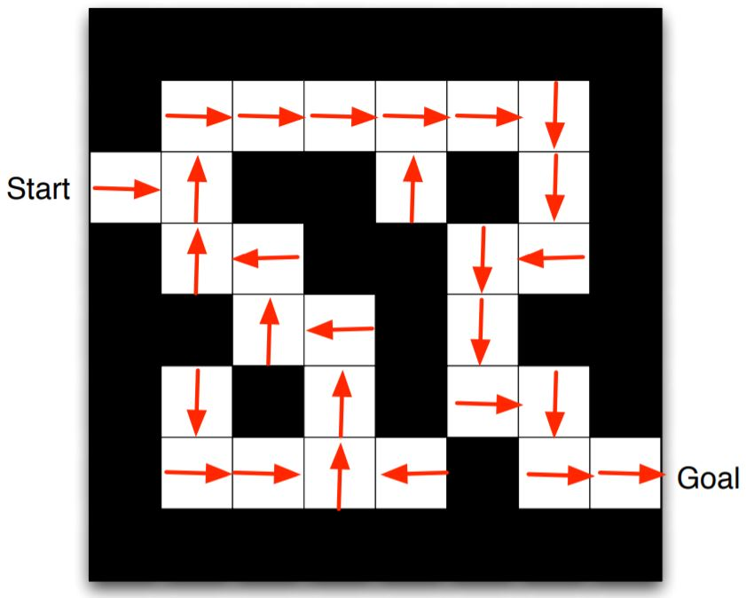
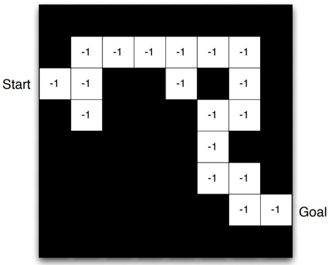
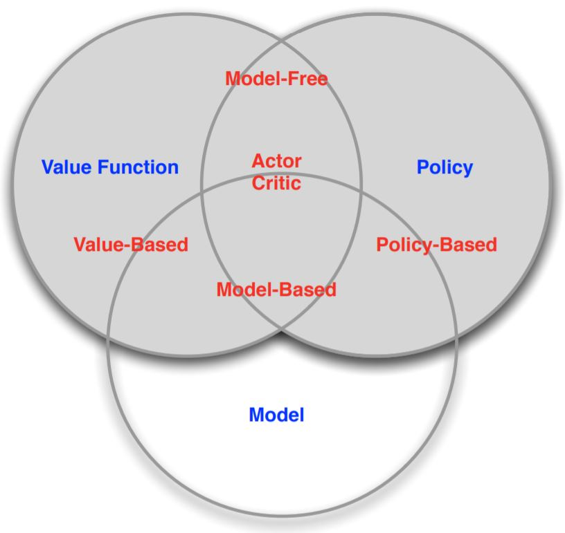
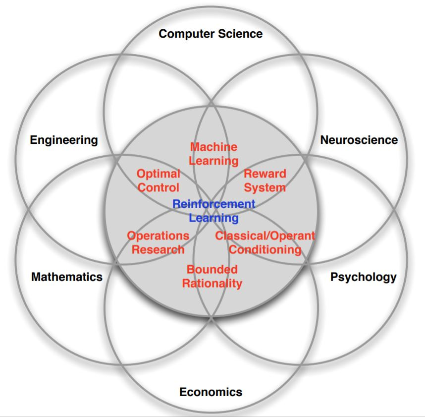
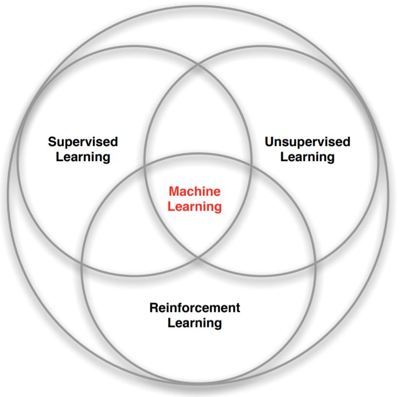

# 100DaysOfMLCode

## Day 1(03Feb2019): Study how pytorch do classification? log_softmax?
 - Q: How to do fastai PointNet?
 - Q: Why pointnet_pytorch they do not directly use cross-entropy? Is it related to special shape of data? 
 Or is it still able to use cross-entropy?
 - A: We can directly define cross-entropy, need not use `log_softmax` and `nll_loss`. Just call 
 `loss = F.cross_entropy(outputs, target)`
 - Q: cross-entropy = log_softmax + nll_loss?
 - A: YES. CrossEntropyLoss() is combination combines LogSoftmax() and NLLLoss() 
 [source](https://pytorch.org/docs/stable/nn.html#torch.nn.CrossEntropyLoss) 
 - Q: How to do softmax? cross-entropy? input/output shape of each one?
 - A: cross-entropy and log_softmax has the same input shape: (N, C, d1, d2, .. , dK)
 - Q: Can it do softmax without *.view(...)?
 - A: need not use *.view, just directly deploy cross_entroypy or nll_loss...

## Day 2(04Feb2019): Code PointNet using cross-entropy instead of log_softmax on pytorch framework
[Source code](https://github.com/minhncedutw/pointnet1_pytorch.git)

## Day 3(05Feb2019): Code PointNet training on fastai framework
[Source code](https://github.com/minhncedutw/pointnet1_fastai.git)

## Day 4(06Feb2019): How to test/evaluate network on fastai framework
- *Prediction* on <ins>validation data</ins>:
```python
pred_logits = learner.predict(is_test=False) # is_test=False -> test on validation dataset; is_test=True -> test on test dataset
pred_labels = np.argmax(pred_logits, axis=1)
pred_probs = np.exp(pred_logits[:,1])
```

or:
```python
pred_logits, true_label = learner.TTA(is_test=False) # 'test time augmentation' func return logit predictions and labels of augmented data
pred_probs = np.mean(np.exp(pred_logits),0) # this func convert logits to probabilities(by default, each data causes 4 
                                            # augmented data, so each test data has 5 returned results, so we have to 
                                            # use np.mean to get predicted probability of each test data 
```

- *Prediction* on <ins>test data</ins>:
`
log_preds, y = learner.TTA(is_test=True)
probs = np.mean(np.exp(log_preds),0)
`

- How to *evaluate*:
`
accuracy_np(probs, y)
`

- How to train:
    + Gross training: 
    `lrf=learn.lr_find()
     learn.sched.plot()
     learn.sched.plot_lr()
     learn.fit(1e-2, 1)`
    + Finetune training: 
    `lrs=np.array([1e-4,1e-3,1e-2])
     lrf=learn.lr_find()
     learn.sched.plot()
     learn.sched.plot_lr()
     learn.fit(lrs, 3, cycle_len=1, cycle_mult=2)`
   
## Day 5(07Feb2019): How to get train/val/tes data on fastai framework

- Get data from model_data:
```python
x,y = next(iter(model_data.trn_dl))
x,y = next(iter(model_data.val_dl))
x,y = next(iter(model_data.tes_dl))
```

- But *before* taking data from model_data, we have to define model_data:
```python
model_data = ImageClassifierData.from_csv(path=PATH, tfms=tfms_from_model(f_model=arch, sz=sz, aug_tfms=None))
#                                                    transformation       architecture  size   augmentation
```
```python
model_data = ImageClassifierData.from_paths(path=PATH, tfms=tfms_from_model(f_model=arch, sz=sz))
```
```python
# example of custom data model:
trn_ds = load_data_function(...)
val_ds = load_data_function(...)

trn_dl = DataLoader(dataset=trn_ds, batch_size=batch_size, shuffle=True, num_workers=0, pin_memory=True)
val_dl = DataLoader(dataset=val_ds, batch_size=batch_size, shuffle=False, num_workers=0, pin_memory=True)
tes_dl = None

model_data = ModelData(path=directory, trn_dl=trn_dl, val_dl=val_dl, test_dl=None)
```

- Before defining model_data, we may need to define transformation:
```python
tfms = tfms_from_model(f_model=f_model, sz=sz, aug_tfms=transforms_side_on, crop_type=CropType.NO)
```

## Day 6(08Feb2019): Code dogs-cats classification on fastai framework

[Practiced code](day6[dogscats_fastai]/PRAC_lesson_1.ipynb)

## Day 7(09Feb2019): How learner.fit works?(fastai framework)

- Training usual
`learner.fit(lrs=lr, n_cycle=1) # learning rate is constant(usual training technique)`


`learner.fit(lrs=lr, n_cycle=1, cycle_len=1) # learning rate is a curve, the frequency of the curve is 1(learning rate annealing)`


`learner.fit(lrs=lr, n_cycle=1, cycle_len=2) # => cycle of learning rate curve is 2 epochs, loop 1 times, epochs=2`


`learner.fit(lrs=lr, n_cycle=2, cycle_len=1) # => cycle of learning rate curve is 1 epochs, loop 2 times, epochs=2(SGD with restarts)`


`learner.fit(lrs=lr, n_cycle=2, cycle_len=2) # => cycle of learning rate curve is 2 epochs, loop 2 times, epochs=4(SGD with restarts)`


`learner.fit(lrs=lr, n_cycle=3, cycle_len=1, cycle_mult=2) # => This SGD with restarts sometimes give awesome results(total epochs=1+2+4=7)`
`# the cycle of LR is double at the end of each train cycle`


> total epochs = n_cycle * cycle_len

-  Training different learning rates for different layers(groups of layers):
```python
lrs = np.array([1e-4,1e-3,1e-2])
learner.fit(lrs=lrs, n_cycle=3, cycle_len=1)
```
> The first few layers will be at 1e-4, the middle layers at 1e-3, and our FC layers we'll leave at 1e-2. To do this, the model architecture must be defined as 3 layers.

## Day 8(10Feb2019): How to predict from arbitrary data

```python
# predict from array
pred_logs = learner.predict_array(arr=array)
pred_labels = np.argmax(pred_logs, axis=1)
pred_probs = np.exp(pred_logs[:,1])
``` 

or
```python
# predict from array
pred_logs = preds = to_np(learner.model(V(T(array).cuda())))
pred_labels = np.argmax(pred_logs, axis=1)
pred_probs = np.exp(pred_logs[:,1])
``` 

or
```python
# predict from data loader
bx, by = next(iter(val_dl))
pred_logs = learner.predict_array(arr=bx)
pred_labels = np.argmax(pred_logs, axis=1)
pred_probs = np.exp(pred_logs)
acc = accuracy_np(pred_probs, by)
metrics.log_loss(y, pred_probs)
```

## Day 9(11Feb2019): How fastai summary network architecture?

```python
learner.summary()
```

How fastai split train/val data?
    - fastai does NOT split data
    - split manually or use the supplied `get_cv_idxs` function

## Day 10(12Feb2019): How fastai normalize/denomalize?
- Normalize
```python
stats = (np.array([ 0.4914 ,  0.48216,  0.44653]), np.array([ 0.24703,  0.24349,  0.26159])) # normalizing data
tfms = tfms_from_stats(stats=stats, sz=sz, aug_tfms=[RandomFlip()], pad=sz//8)
data = ImageClassifierData.from_csv(PATH, 'train', PATH/'train.csv', tfms=tfms, bs=bs)
```

- Denormalize
```python
x, y = next(iter(model_data.test_dl))
denormed_data = model_data.test_ds.denorm(x)[0]
plt.imshow(denormed_data)
```

## Day 11(13Feb2019): How pytorch normalize/denomalize?
- Normalize
```python
transform = transforms.Compose([transforms.ToTensor(), transforms.Normalize(means=(0.5, 0.5, 0.5), std=(0.5, 0.5, 0.5))])
trainset = torchvision.datasets.CIFAR10(root='./data', train=True,
                                        download=True, transform=transform)
trainloader = torch.utils.data.DataLoader(trainset, batch_size=4,
                                          shuffle=True, num_workers=2)
```

- Denormalize
```python
inv_normalize = transforms.Normalize(mean=[-0.5/0.5, -0.5/0.5, -0.5/0.5], # -mean/std
                                     std=[1/0.5, 1/0.5, 1/0.5] # 1/std
)
inv_tensor = inv_normalize(tensor)
```

## Day 12(14Feb2019): Different Type of Convolution in Deep Learning?

>Convolution v.s. Cross-correlation
3D Convolution
1 x 1 Convolution
Transposed Convolution (Deconvolution, checkerboard artifacts)
Dilated Convolution (Atrous Convolution)
Separable Convolution (Spatially Separable Convolution, Depthwise Convolution)
Flattened Convolution
Grouped Convolution
Shuffled Grouped Convolution
Pointwise Grouped Convolution

[Source](https://towardsdatascience.com/a-comprehensive-introduction-to-different-types-of-convolutions-in-deep-learning-669281e58215?fbclid=IwAR06RxGPwRmN_6lzgKypLxcQm0r2YPtebBHxclpKXsZ1D96n56NVnGugBt8)

## Day 13(15Feb2019): Different Type of GAN?

>unconditional GAN
conditional GAN
SS-GAN

### Questions:
- what is different between 3 kinds of GANs?

## Day 14(16Feb2019): How to run pytorch network on cuda?
```python
device = torch.device("cuda:0" if torch.cuda.is_available() else "cpu")
...
net.to(device)
...
inputs, labels = inputs.to(device), labels.to(device)
```

## Day 15(17Feb2019): How fastai show learned features?

## Day 16(18Feb2019): USING T-SNE TO VISUALISE HOW YOUR MODEL THINKS?

*Keras-Embedding Visualization* [tensorboard_embeddings_mnist.py](https://github.com/keras-team/keras/blob/36b9e4c055f32718a036cabaf767325b010c7485/examples/tensorboard_embeddings_mnist.py#L64)
*Good illustration* [TENSORFLOW - EMBEDDING VISUALISATION MNIST DATASET](https://www.youtube.com/watch?v=EL0wVFz0gsc)
*Good doc* [USING T-SNE TO VISUALISE HOW YOUR MODEL THINKS](https://buzzrobot.com/using-t-sne-to-visualise-how-your-deep-model-thinks-4ba6da0c63a0)
*Good doc* [MANIFOLD LEARNING ON HANDWRITTEN DIGITS](https://scikit-learn.org/stable/auto_examples/manifold/plot_lle_digits.html#sphx-glr-auto-examples-manifold-plot-lle-digits-py)

## Day 17(19Feb2019): ?

## Day 18(20Feb2019): Overview about Deep Reinforcement Learning?

What is an RL agent? Ans: It is composed from:
- Reward value:

- Policy:

- Model state:


Categorizing:


*Good lessons* [UCL Course on RL](http://www0.cs.ucl.ac.uk/staff/d.silver/web/Teaching.html)

[A DEEP DIVE INTO REINFORCEMENT LEARNING](https://www.toptal.com/machine-learning/deep-dive-into-reinforcement-learning)





## Day 25(27Feb2019): ?

## Day 26(28Feb2019): Learn TensorFlow 2.0 on [UDACITY](https://www.udacity.com/course/intro-to-tensorflow-for-deep-learning--ud187?fbclid=IwAR1hWOw9_WBMoe7gAQOyppYtr82lDxy0gu3u8bre4VMoG8w4nVIPHEAKIAc) - Use TensorFlow like Keras
- Lesson 1&2&3:
*Practiced Code*
[](https://drive.google.com/open?id=1nrOW-tlFN_B6zQKHWDYuKtS-64glCYZP)
[](https://drive.google.com/open?id=1cKs5sR_Qhng3l4JKbmUhsqrWBG-kmszs)
[](https://drive.google.com/open?id=1vkRG9NeHkBk5vTekxRz8whzIjR0kA-k-)

*Use tensorflow like keras*
```python
model = tf.keras.Sequential([
    tf.keras.layers.Flatten(input_shape=(28, 28, 1)),
    tf.keras.layers.Dense(units=128, activation=tf.nn.relu),
    tf.keras.layers.Dense(units=10, activation=tf.nn.softmax)
])

model.compile(optimizer='adam',
              loss = 'sparse_categorical_crossentropy',
              metrics=['accuracy'])

history = model.fit(train_dataset, epochs=10, steps_per_epoch=math.ceil(num_train_examples/batch_size))
```

## Day 27(01Mar2019): Learn TensorFlow 2.0 on [COURSERA](https://www.coursera.org/learn/introduction-tensorflow) - Basic Knowledge
- Lesson 1
[Practiced Code](https://drive.google.com/open?id=1GS3zwZxCr8pFWU_Y-GXi4pVINh8ciQ5z)

*The way to get sample of a function in colab*

**source** [GET STARTED WITH GOOGLE COLABORATORY (CODING TENSORFLOW)](https://youtu.be/inN8seMm7UI)

*Compare algorithms on MNIST*

[FASHION-MNIST](https://github.com/zalandoresearch/fashion-mnist)

## Day 28(02Mar2019): Learn TensorFlow 2.0 on [COURSERA](https://www.coursera.org/learn/introduction-tensorflow) - Callbacks?
- Lesson 2&3:
[Practiced Code](https://drive.google.com/open?id=13UrqN73m8VW4U8qCY8ZnRR7pH1sQBx0-)
[Practiced Code](https://drive.google.com/open?id=1UjAZfTze-AqoJ6nfVLGHJ0bWZlJvOBcr)

*How to code Custom callback to get 'acc' value and stop at condition*
```python
class myCallBack(tf.keras.callbacks.Callback):
    def on_epoch_end(self, epochs, log={}):
        if (log.get('acc') > 0.95):
            print("\nReached 95% accuracy so cancelling training!")
            self.model.stop_training = True
```

*Lesson about CNN of Andrew Ng*
[Convolutional Neural Networks(Course 4 of the Deep Learning Specialization)](https://www.youtube.com/playlist?list=PLkDaE6sCZn6Gl29AoE31iwdVwSG-KnDzF)

## Day 29(03Mar2019): OpenAI Text Generator - Generative Pre-Training
Siraj Raval video: [OPENAI TEXT GENERATOR](https://www.youtube.com/watch?v=0n95f-eqZdw)

*Main content*:
- Introduce GPT-2 (Generative Pre-Training 2)
- Applications of GPT-2: machine translation, summarization, question answering -> chat bot
- Principles of GPT-2

*Download and Run*: [gpt-2](https://github.com/openai/gpt-2)

## Day 30(04Mar2019): Learn TensorFlow 2.0 on [Coursera](https://www.coursera.org/learn/introduction-tensorflow)

- Lesson 4:
[Practiced Code]()

*Knowledge*
- relu is used in hidden layers
- linear is used in regression
- softmax is used in categorical classification(multiple classes)
- sigmoid is better than softmax in binary classification

*Size of final features affect FC*
> size of finaly features should not be too small, else the FC classification may not be able to converge

## Day 31(05Mar2019): Learn TensorFlow 2.0 on [Coursera](https://www.coursera.org/learn/introduction-tensorflow) - How to observe learnt features?

*How to download at Colab*
```
# Download from a link to a file path
!wget --no-check-certificate \
    https://storage.googleapis.com/laurencemoroney-blog.appspot.com/horse-or-human.zip \
    -O /tmp/horse-or-human.zip
```

*How to unzip file at Colab*
```python
import os
import zipfile

local_zip = '/tmp/horse-or-human.zip'
zip_ref = zipfile.ZipFile(local_zip, 'r')
zip_ref.extractall('/tmp/horse-or-human')
zip_ref.close()
```

*How to upload to Colab through simple dialog?*
```python
import numpy as np
from google.colab import files
from keras.preprocessing import image

uploaded = files.upload() # Create a dialog to upload the file

for fn in uploaded.keys():
 
  # Obtain uploaded files
  path = '/content/' + fn
  img = image.load_img(path, target_size=(300, 300))
  x = image.img_to_array(img)
  x = np.expand_dims(x, axis=0)
  images = np.vstack([x])
  
  """
  Below is custom codes depended on your purpose
  """
  classes = model.predict(images, batch_size=10)
  print(classes[0])
  if classes[0]>0.5:
    print(fn + " is a human")
  else:
    print(fn + " is a horse")
```
*How to observe learned features?*
```python
successive_outputs = [layer.output for layer in model.layers[1:]]
visualization_model = tf.keras.models.Model(inputs=model.input, outputs=successive_outputs) # Define a model that obtain learnt features of each layer in model

successive_feature_maps = visualization_model.predict(x) # get feature map
```
[source](https://drive.google.com/open?id=1rXD7Kr3gHIydnkxo4jX2JAGotFADOTIb)

## Day 32(06Mar2019): How to create model of Multiple Inputs/Outputs in Keras?

 - Multiple Inputs(single type) - Single Output
```python
# define two sets of inputs
inputA = Input(shape=(32,))
inputB = Input(shape=(128,))
 
# the first branch operates on the first input
x = Dense(8, activation="relu")(inputA)
x = Dense(4, activation="relu")(x)
x = Model(inputs=inputA, outputs=x)
 
# the second branch opreates on the second input
y = Dense(64, activation="relu")(inputB)
y = Dense(32, activation="relu")(y)
y = Dense(4, activation="relu")(y)
y = Model(inputs=inputB, outputs=y)
 
# combine the output of the two branches
combined = concatenate([x.output, y.output])
 
# apply a FC layer and then a regression prediction on the
# combined outputs
z = Dense(2, activation="relu")(combined)
z = Dense(1, activation="linear")(z)
 
# our model will accept the inputs of the two branches and
# then output a single value
model = Model(inputs=[x.input, y.input], outputs=z)
```

 - Multiple Inputs(multiple type) - Single Output
 ```python
# create the MLP and CNN models
mlp = models.create_mlp(trainAttrX.shape[1], regress=False)
cnn = models.create_cnn(64, 64, 3, regress=False)

# create the input to our final set of layers as the *output* of both
# the MLP and CNN
combinedInput = concatenate([mlp.output, cnn.output])

# our final FC layer head will have two dense layers, the final one
# being our regression head
x = Dense(4, activation="relu")(combinedInput)
x = Dense(1, activation="linear")(x)

# our final model will accept categorical/numerical data on the MLP
# input and images on the CNN input, outputting a single value (the
# predicted price of the house)
model = Model(inputs=[mlp.input, cnn.input], outputs=x)
```
[source](https://www.pyimagesearch.com/2019/02/04/keras-multiple-inputs-and-mixed-data/)

*How to do multi-inp multi-out?*
 - [such as this](https://keras.io/getting-started/functional-api-guide/#multi-input-and-multi-output-models)

## Day 33(07Mar2019): How to use yeild in python?
```python
def foo():
    for i in range(1000000000):
        if i %100000000==0:
            yield i

print(foo) # WRONG using

# Correct way to use
for i in foo():
    print(i)
```

*Steps to explore and solve an AI problem?*

[source](https://www.kaggle.com/agodwinp/stacking-house-prices-walkthrough-to-top-5/notebook)

## Day 34(08Mar2019): How to design multi-block of layers for network to train multi-lr?
[Practiced code](day34[fastai_multi_lr]/multi_groups_of_layers_for_multi_lrs.py)

## Day 35(10Mar2019): Fastai 2019 - Lesson 1

*How to download to a directory?*
```python
path = untar_data(url=URLs.PETS, dest='./data/'); path
```

*How to obtain data from path and extract labels from names?*
```python
fnames = get_image_files(path_img)

# np.random.seed(2) # not important
pattern = r'/([^/]+)_\d+.jpg$' # define the pattern of the file name

# Data generation from path to images and auto-extract labels from names
data = ImageDataBunch.from_name_re(path=path_img, fnames=fnames, pat=pattern, 
                                   ds_tfms=get_transforms(), size=224, bs=bs
                                  ).normalize(imagenet_stats)
```

## Day 57(01Apr2019): Sync google drive to local
*Why should I do this?*
Because when your computer is not powerful enough to run big deep network, it'd better to upload to google and run on colab.
Or, you can sync from google drive to another stronger computer or server to run it.

*For ubuntu 18:*
>https://www.fossmint.com/best-google-drive-clients-for-linux/

*For ubuntu 16:*
> https://github.com/odeke-em/drive

Steps to install drive:
1. Download [binary distribution of Go](https://golang.org/doc/install)
2. Extract and copy to /usr/local: `sudo cp -R go/ /usr/local/`
3. Add this line to `$HOME/.profile`: `export PATH=$PATH:/usr/local/go/bin`
4. Don't forget to apply change: `source $HOME/.profile`
5. Run these command lines line by line:
```commandline
cat << ! >> ~/.bashrc
> export GOPATH=\$HOME/gopath
> export PATH=\$GOPATH:\$GOPATH/bin:\$PATH
> !
source ~/.bashrc # To reload the settings and get the newly set ones # Or open a fresh terminal
```
6. Get the drive by running: `go get -u github.com/odeke-em/drive/cmd/drive`
7. Create drive folder that connect to google drive: 
```commandline
drive init ~/gdrive
cd ~/gdrive
```
8. Sync to local by typing command line: `drive pull`
9. Sync to remote by typing command line: `drive push`

## FastAI Lessons:

https://course.fast.ai/videos/?lesson=6

https://www.youtube.com/user/howardjeremyp/playlists

## Questions: 
 - How to run pytorch network on cuda?
 - Why fastai/pytorch return logs of predictions rather than probabilities?
 - How fastai custom metrics, loss_function?
 - How fastai group the layers for training many lr?
 - What is wds?
 - How fastai show learned features?
 - How deploy an app to github?
 
## AI Magazine:
https://paperswithcode.com/sota?fbclid=IwAR0EGz0FvBiX8AROM1madjSxhpDxLJ_pNGVk5oR4p-cREuWmrGh-F1OX1jQ
https://www.rsipvision.com/computer-vision-project-management/


